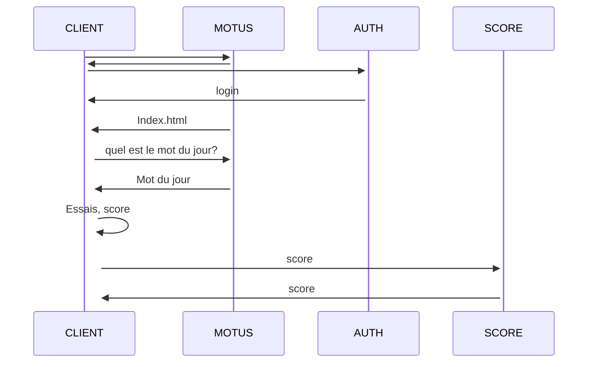

1.Explication du fonctionnement de l'application.
 
Nous avons créé l'application SUTOM :  il s'agit d'un jeu dans lequel un utilisateur doit deviner le mot du jour en le saissisant, il a comme indice la première lettre du mot du jour.
 
Cette application comporte 3 serveurs : 
-un serveur authentification: qui permet à un client de s'authentifier avant de pouvoir jouer
-un serveur Motus :qui est le serveur où le client peut jouer(entrer le mot du jour)
-un seveur score : qui sert à voir le nombre de reussite du joueur.
 
2.comment lancer l'application?
 

sudo docker-compose up --build
 
 

Trois dossiers ont été créés (SutomApp, Auth et Score) donc chacun correspond à un microservice. IL ya aussi 3 Dockerfile pour chaque microservice qui permettent chacun de lancer un serveur.
Le fichier docker-compose.yml qui permet de lancer les 3 serveurs (micro-services) en exécutant la commande docker-compose up. Si nous allons sur un navigateur (Chrome, edge, etc.) et que nous entrons localhost:3000(qui est le port sur lequel tourne le serveur SutomApp), on est automatiquement rédirigé vers le port 4000 sur lequel tourne le serveur d'authentification si l'utilisateur n'est pas connecté.
Une page de connexion s'affiche et il peut se connecter en entrant ses identifiants. Si l'utilisateur tente de se connecter en entrant ses identifiants username et mot de passe, si il existe dans la liste des utilisateurs qui se trouve dans un fichier JSON, il est redirigé vers le port 3000 ou il peut entrer le mot du jour, si non il devra retenter la connexion. Si le mot du jour est correct l'utilisateur a plus un dans son score qui est stocké dans le serveur Score.

 NB : pour entrer le mot du jour, il faut entrer lettre par lettre dans chaque case, la redirection vers la case suivante n'est pas automatique.

3.Diagramme de séquence
 

 
4.Next steps
 
les prochaines étapes seront d'améliorer la page jeu de sorte à ce que la redirection d'une case à l'autre pour entrer les lettres du mot soit automatique.   